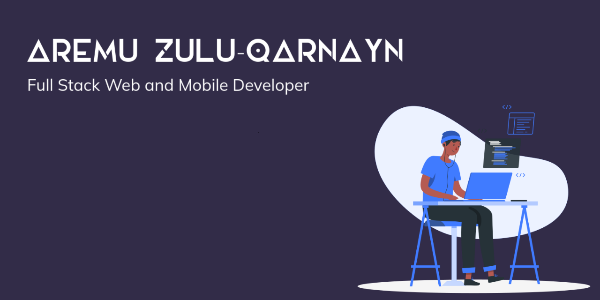
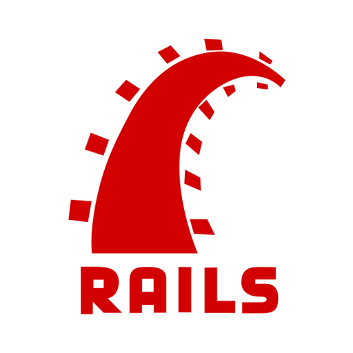
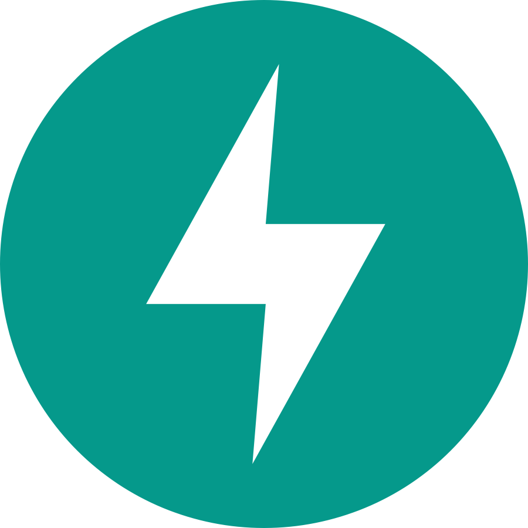
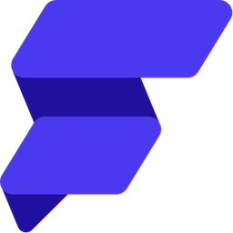
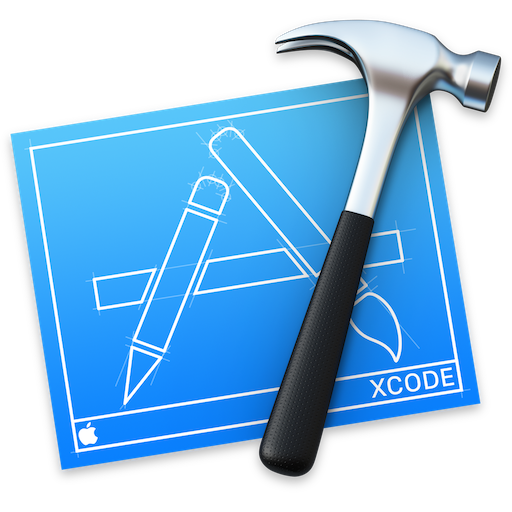

### Hi there 👋

## Bio

Fullstack web and mobile developer with proficiency in multiple programming languages and technologies such as cross-platform applications, operating systems, API development and integration, virtualization, networking, cloud computing, system and software design, software testing, versioning, responsive and reactive user interfaces and implementing complex business logic.

## Languages

-   HTML
-   CSS
-   C+
-   SQL
-   Dart
-   Ruby
-   Python
-   JavaScript
-   Bash Script

## Frameworks
-   Flutter
-   Django
-   React
-   React Native
-   Ruby on Rails
-   Fast API

## Tools
-   Flutter Flow
-   Linux
-   git
-   VS Codium
-   Andrid Studio
-   Xcode

## Connect
-   [Instagram](https://instagram.com/d3ad_s0ul_x)
-   [whatsapp](https://Wa.me/2349055677860)
-   [Twitter](https://twitter.com/dhulqarnayn4)
-   [Linkedin](https://LinkedIn.com/in/zulu-qarnayn)

<!--
**tech-nyn/tech-nyn** is a ✨ _special_ ✨ repository because its `README.md` (this file) appears on your GitHub profile.

Here are some ideas to get you started:

- 🔭 I’m currently working on ...
- 🌱 I’m currently learning ...
- 👯 I’m looking to collaborate on ...
- 🤔 I’m looking for help with ...
- 💬 Ask me about ...
- 📫 How to reach me: ...
- 😄 Pronouns: ...
- ⚡ Fun fact: ...
-->
